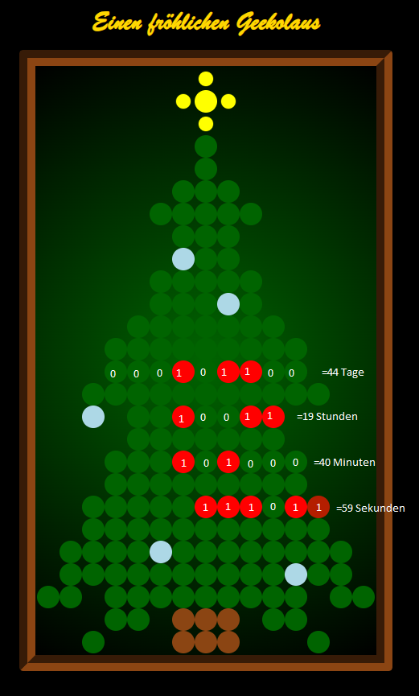

# JsCss-Binary-Countdown-Timer
A Binary countdown timer written in HTML, CSS and JavaScript

## About the project

This is a plain JS, CSS, HTML implementation of a Countdown Timer which visualizes the left time as binary in the format d/h/m/s.

The project is a part of a challenge by [Codespere](https://codesphere.com/) and is free to use and change for everybody.

There are two versions of the timer. The main version is the Christmas Eve countdown, visualized as a Christmas tree.
The second one is a [simplified version](https://github.com/TheTrueDon/JsCss-Binary-Countdown-Timer/tree/main/simpelTimer) that is a nearly plain looking timer with pretty much basic functionality and design for quick and easy modification.

## How to read the timer

The timer is presented as a pixelart Christmas tree, with ornaments. The red ornaments are special because they change constantly.

There are four rows of red ornaments. Every circle in the row represents a bit (red equals 1, green equals 0) and the binary numers are alsways starting
on the right hand border of the tree. the lowest row represents seconds, the row above minutes, above hours and above days till Christmas Eve.
If you add them you get the left time until Christmas Eve, or whatever point in time you define in your implementation.

## Files and usage

The JS is split in timer.js for the functionality of the timer interval and the timerFace.js for any visualization of the timer.

The CSS file timer.css creates a grid for the "pixel"-like presentation.

You just have to include the scripts and stylesheet into your HTML file as shown in index.html or simpleTimer/timer.html and add the line
`` with "tabContent1" as placeholder for any id of a section in your html file.

